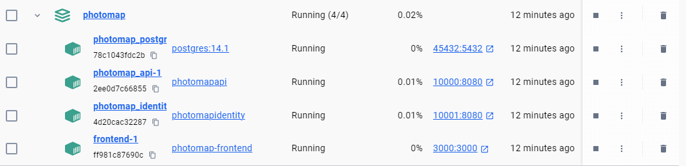
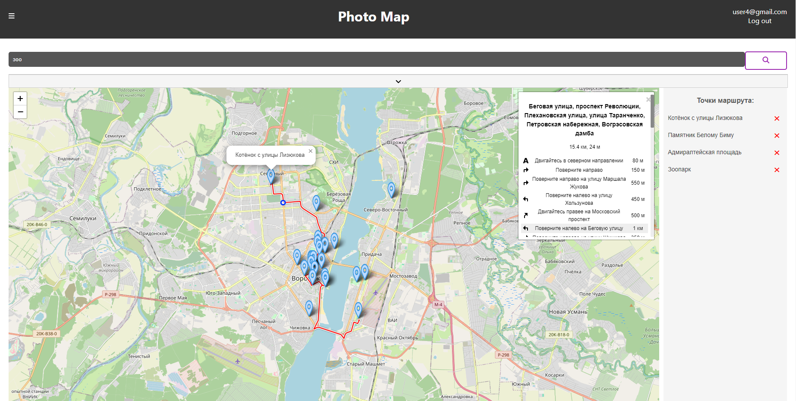
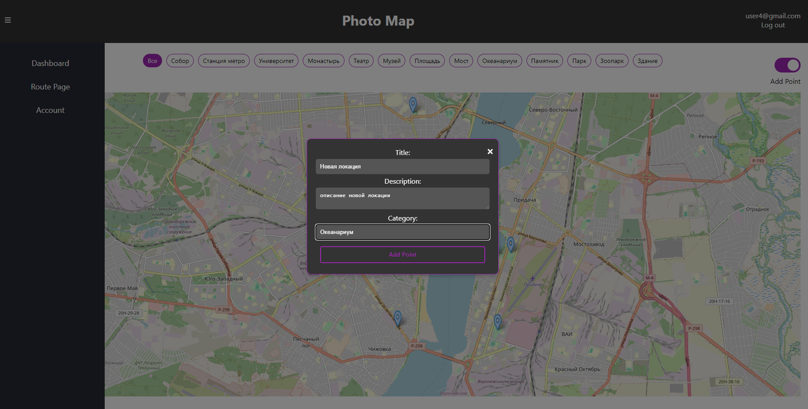
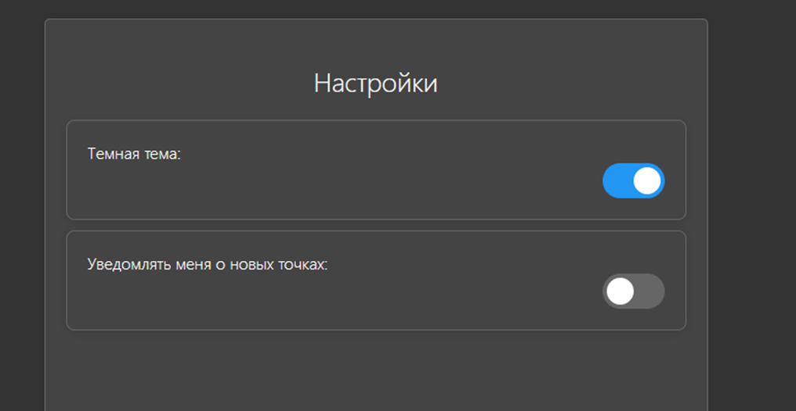
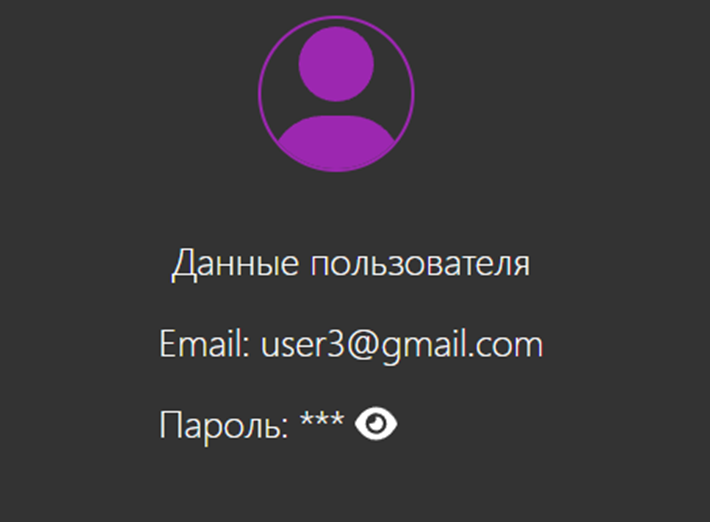

# PhotoMap - портал для туристов, фотографов, блогеров

Алгоритм для запуска:
1. Скачать исходники
2. Открыть cmd находясь в папке backend\PhotoMap
3. Выполнить команду docker-compose build
4. Выполнить команду docker-compose up
5. Проверить, что в докере появилось 3 контейнера
6. В случае если контейнер photomap-api упал, поднять его заново (он мог упасть если контейнер с бд поднялся позже него)
7. Зайти в каталог frontend\photomap, запустить другое окно cmd
8. Выполнить команду docker-compose build
9. Выполнить команду docker-compose up
10. Проверить, что в докере появился еще один контейнер в созданном раннее кластере
11. Убедиться, что все 4 конейнера запущены

12. Для корректного отображения маркеров открывать сайт в Яндекс браузере
13. Перейти по адресу http://localhost:3000
14. Дождаться загрузки точек из бд (возможно займет несколько секунд)

Данные для авторизации: 
логин: admin@dsrphotomap.com
пароль: Pass1234

В PhotoMap можно:

- Отмечать локации на карте
- Выкладывать фото локаций
- Делиться впечатлениями в отзывах
- Составлять мультимаршруты между интересующими локациями
- Получить детализацию маршрута
- Подписываться на email уведомления
- Переключаться между светлой и темной темой

Алгоритм для добавления точки:
1. Авторизоваться
2. В правом верхнем углу включить режим Add point
3. Кликнуть на карте в том месте, где собираетесь добавить точку
4. В появившемся окне ввести данные, катерогию выбрать в выпадающем списке
5. После нажатия кнопки Ок точка отобразится на карте
6. Для корректности дальнейших действий рекомендуется обновить страницу

Алгоритм для добавления фото:
1. Авторизоваться
2. Кликнуть на точку
3. Кликнуть на кнопку Добавить фото
4. Выбрать файл
5. Фото должно автоматически подхватиться
6. Обновить страницу и кликнуть на ту же точку - фото отобразится в верхней части всплывающего окна

Алгоритм для добавления отзыва:
1. Авторизоваться
2. Кликнуть на точку
3. Кликнуть на кнопку Добавить отзыв
4. Заполнить необходимые поля
5. Нажать на Ок
6. Обновить страницу и кликнуть на ту же точку - отзыв отобразится 

Возможные проблемы:
1. Точка не добавляется. 

Решение - обновить страницу, выйти и войти в аккаунт 
2. Фото не добавляется к только что добавленной точке. 

Решение - обновить страницу и повторить процедуру
3. Не получается авторизоваться под данными админа

Решение - нажать на кнопку регистрации, зарегистрироваться под любыми данными, потом под ними же авторизоваться

Рис. 1 - Основной экран, просмотр, сортировка по категориям, добавление локаций пользователями

Рис. 2 - Составление мультимаршрута, детализация маршрута

Рис. 3 - Добавление новой локации по клику на карте

 
Рис. 4 - Фрагменты экранов настроек и данных аккаунта
